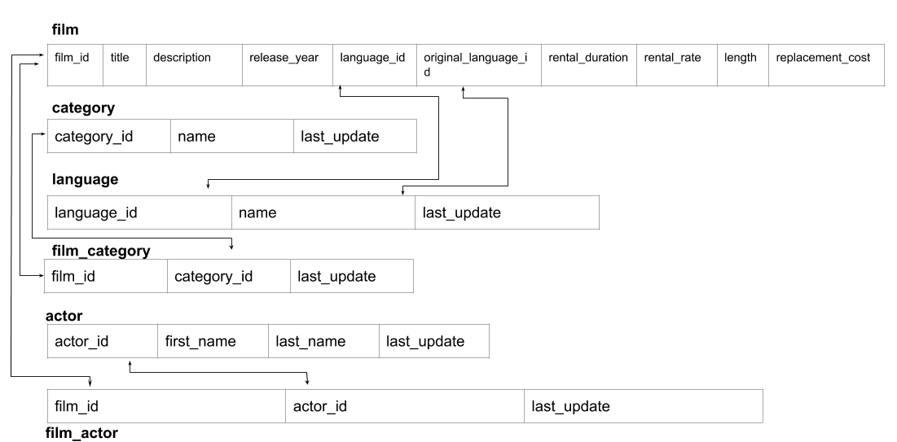

### Advanced SQL Assignment Part A
#### Question 1
Create a table called client with the following columns:
- id - an auto-incrementing integer which is the primary key, size 11
- first_name - a varchar with a maximum length of 255 characters, cannot be null
- last_name - a varchar with a maximum length of 255 characters, cannot be null
- dob - a date type with no default and null not allowed
- The combination of the first_name and last_name must be unique in this table.  Name this constraint as full_name

Create a table called employee with the following columns:
- id - an auto-incrementing integer which is the primary key, size 11
- first_name - a varchar of maximum length 255, cannot be null
- last_name - a varchar of maximum length 255, cannot be null
- dob - a date cannot be null
- date_joined - a date cannot be null
- The combination of the first_name and last_name must be unique in this table. Name this constraint as full_name

Create a table called project with the following columns:
- id - an auto-incrementing integer which is the primary key, size 11
- cid - an integer which is a foreign key reference to the client table
- name - a varchar of maximum length 255, cannot be null
- notes - a text column
- The project name must be unique in this table

Create a table called works_on representing a many-to-many relationship between employees and projects, with the following properties:
- eid - an integer which is a foreign key reference to the employee table
- pid - an integer which is a foreign key reference to the project table
- start_date - a date, not null
- The primary key is a combination of eid and pid

> Answer: [`partA-question1.sql`](./partA-question1.sql)

#### Question 2
Insert the following into the client table:

| First Name	| Last Name	    | DOB |
| ------------- | ------------- | --- |
| Sara          | Smith	        | 1/2/1970 |
| Miguel	    | Cabrera       | 2/2/1988 |
| Bo            | Chang         | 3/2/1985 |
 
Insert the following into the employee table:

| First name    |	Last name   | DOB | Date Joined |
| ------------- | ------------- | ----| --------- |
| Ananya        | Jaiswal       | 1/2/1975 | 1/1/2009 |
| Michael       | Fern          | 10/18/1980 | 6/5/2013 |
| Abdul         |	Rehman	    | 3/21/1984	| 11/10/2013 |
 
Insert the following project instances into the project table (you should use a subquery to set up foreign key references and not hard-coded numbers):

| cid | name | notes |
| ------------- | ------------- | ------------- |
| reference to Sara Smith | Diamond | Should be done by Jan 2019 |
| reference to Bo Chang	| Chan'g | Ongoing maintenance |
| reference to Miguel Cabrera | The Robinson Project | NULL |
 
Insert the following into the works_on table. Again, your queries here should not have hard-coded integers for foreign keys.

| employee | project | start_date |
| ------------- | ------------- | --- |
| Ananya Jaiswal |	Chan'g | 1/1/2012 |
| Michael Fern | The Robinson Project | 8/8/2013 |
| Abdul Rehman | Diamond | 9/11/2014 |

> Answer: [`partA-question2.sql`](./partA-question2.sql)

### Advanced SQL Assignment Part B
Database: [`sakila-db.sql`](./sakila-db.sql)

#### Question 1

Find all films with maximum length or minimum rental duration (compared to all other films).
In other words let L be the maximum film length, and let R be the minimum rental duration in the table film.
You need to find all films that have length L or duration R or both length L and duration R.
If a film has either a maximum length OR a minimal rental duration it should appear in the result set.
It does not need to have both the maximum length and the minimum duration.
You just need to return the film_id for this query.
Order your results by film_id in ascending order.

> Answer: [`partB-question1.sql`](./partB-question1.sql)

#### Question 2
We want to find out how many of each category of film ED CHASE has starred in.
So return a table with category_name and the count of the number_of_films that ED was in that category.
Your query should return every category even if ED has been in no films in that category
Order by the category name in ascending order.

> Answer: [`partB-question2.sql`](./partB-question2.sql)

#### Question 3
Find the first_name, last_name and total_combined_film_length of Sci-Fi films for every actor.
That is the result should list the names of all of the actors(even if an actor has not been in any Sci-Fi films) and the total length of Sci-Fi films they have been in.
Look at the category table to figure out how to filter data for Sci-Fi films.
Order your results by the actor_id in descending order.

> Answer: [`partB-question3.sql`](./partB-question3.sql)

#### Question 4
Find the first_name and last_name of all actors who have never been in a Sci-Fi film.
Order by the actor_id in ascending order.

> Answer: [`partB-question4.sql`](./partB-question4.sql)
