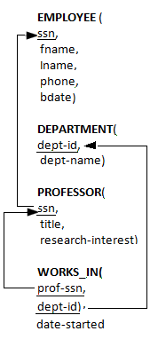

# Quiz 4
Database: [`quiz4_bsg_database_dump.sql`](./quiz4_bsg_database_dump.sql)

### Question 1
Find the number of Certifications held by People grouped by a Planet.
Using the BSG database described in this Quiz's description, find the number of Certifications held by People grouped by a Planet.
This should have two columns:

    "name" will be the names of planets that have at least one certification.
    "CertCount" which will be the number of certifications held by people from that planet

Order your results by planet name in ascending order. Example: If Lee is certified in "Viper" and "Mechanic" and Kara is certified in "Viper" and they are both from Caprica, then the "CertCount" for the planet Caprica should be 3.

> Answer: [`question1.sql`](./question1.sql)

### Question 2
Find people assigned to at least one instance of Viper ship class.
Using the BSG database described in this Quiz's description, find the fname and lname of all people who are assigned to at least one instance of a Viper class ship (this includes all variants of Viper class ships).
Return only a single row per person and sort by fname in ascending order.

> Answer: [`question2.sql`](./question2.sql)

### Question 3
Find the people who do not have Viper Certification but are still assigned to Viper class ship.
Find the fname, lname, and ship_instance_id for all people who do not have Viper certification but are assigned to at least one instance of a Viper class ship (this includes all variants of Viper class ships).
 Return a row for every ship/person combination.
Order your results by fname in ascending order.

> Answer: [`question3.sql`](./question3.sql)

### Question 4
True or False: LEFT JOIN gets all records from the LEFT table but if you have selected some columns from the RIGHT table and if no matches are found in the RIGHT table, these columns will contain NULL.

> Answer: True

### Question 5
Which of the following queries contains an error?
<ol type="a">
  <li>SELECT * FROM EMPLOYEE WHERE first_name <> 'David';</li>
  <li>SELECT first_name FROM EMPLOYEE;</li>
  <li>SELECT first_name WHERE first_name='David' and last_name='Smith';</li>
  <li>None of these</li>
</ol>

> Answer: c. SELECT first_name WHERE first_name='David' and last_name='Smith';

### Question 6
In the query,

`SELECT _____ first_name FROM EMPLOYEE`

Choose one of the following for the blank space above, if we want to display the unique values for the column.
<ol type="a">
    <li>Unique</li>
    <li>Distinct</li>
    <li>All</li>
    <li>Group By</li>
</ol>

> Answer: b. Distinct

### Question 7
True or False: HAVING clause.

The purpose of a HAVING clause in a query is to apply conditions to the groups formed by "GROUP BY".

> Answer: True

### Question 8
Which of the functions below is not an aggregate function ?
<ol type="a">
    <li>count</li>
    <li>avg</li>
    <li>sum</li>
    <li>mean</li>
</ol>

> Answer: d. mean

### Question 9
How does ON DELETE CASCADE work?

True or False: A Foreign Key with ON DELETE CASCADE means that if a record in the referenced table is deleted, then the corresponding records in the referencing table will automatically be deleted too.

> Answer: True

### Question 10

Which of the following finds the first name and last name10+ of all employees who are professors with the title as 'assistant professor' and first names starting with the letter W.

<ol type="a">
    <li>SELECT fname, lname FROM EMPLOYEE WHERE fname LIKE 'W%' AND ssn IN ( SELECT ssn FROM PROFESSOR WHERE title = 'assistant professor' );</li>
    <li>SELECT fname, lname FROM EMPLOYEE WHERE fname LIKE 'W%' AND ssn = (SELECT ssn FROM PROFESSOR WHERE title = 'assistant professor');</li>
    <li>SELECT fname, lname FROM EMPLOYEE INNER JOIN PROFESSOR ON EMPLOYEE.ssn = PROFESSOR.ssn WHERE fname LIKE "W%" AND title = 'assistant professor';</li>
    <li>SELECT fname, lname FROM EMPLOYEE WHERE fname LIKE 'W%' AND ssn = (SELECT ssn FROM EMPLOYEE WHERE title = 'assistant professor');</li>
    <li>All of these</li>
    <li>None of these</li>
</ol>

> Answer: a. and c.

