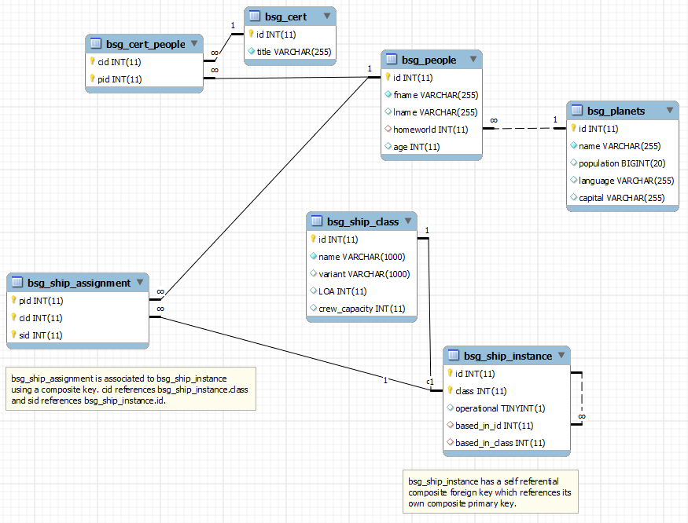

# Quiz 4
Database: [`quiz4_bsg_database_dump.sql`](./quiz4_bsg_database_dump.sql)

### Question 1

Find the number of Certifications held by People grouped by a Planet.
Using the BSG database described in this Quiz's description, find the number of Certifications held by People grouped by a Planet.
This should have two columns:

    "name" will be the names of planets that have at least one certification.
    "CertCount" which will be the number of certifications held by people from that planet

Order your results by planet name in ascending order. Example: If Lee is certified in "Viper" and "Mechanic" and Kara is certified in "Viper" and they are both from Caprica, then the "CertCount" for the planet Caprica should be 3.

> Answer: [`question1.sql`](./question1.sql)

### Question 2

Find people assigned to at least one instance of Viper ship class.
Using the BSG database described in this Quiz's description, find the fname and lname of all people who are assigned to at least one instance of a Viper class ship (this includes all variants of Viper class ships).
Return only a single row per person and sort by fname in ascending order.

> Answer: [`question2.sql`](./question2.sql)

### Question 3

Find the people who do not have Viper Certification but are still assigned to Viper class ship.
Find the fname, lname, and ship_instance_id for all people who do not have Viper certification but are assigned to at least one instance of a Viper class ship (this includes all variants of Viper class ships).
 Return a row for every ship/person combination.
Order your results by fname in ascending order.

> Answer: [`question3.sql`](./question3.sql)
